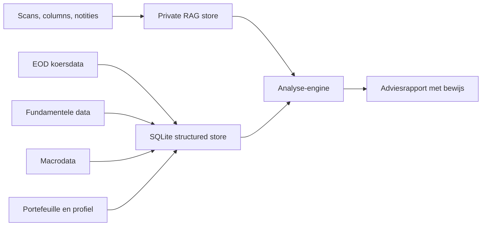

# Architectuur

## Doel

Een persoonlijke beleggingsraadgever die niet alleen een oordeel geeft, maar ook
laat zien welke cijfers, principes en bronnen tot dat oordeel leiden.

## Structured data

SQLite is de standaard opslag voor v1. Dat is bewust eenvoudig:

- lokaal
- inspecteerbaar
- makkelijk te back-uppen
- geen server nodig
- sterk genoeg voor end-of-day analyses

Structured data bevat onder meer:

- tickers
- fundamentele snapshots
- marktdata
- macro-observaties
- portefeuilleposities
- investor profile
- adviesruns

## RAG/vectorlaag

De kennislaag bevat:

- Beleggers Belangen-columns
- eigen notities
- investment principles
- relevante jaarverslag- of transcriptfragmenten

V1 bevat een lokale hashing-vectorizer. Dat is geen eindstation, maar geeft ons
wel direct een testbare RAG-flow zonder externe dependency.

Latere opties:

- OpenAI embeddings
- lokale sentence-transformer
- LanceDB, Chroma, pgvector of sqlite-vss

## Analyse-engine

De analyse-engine combineert:

- quality score
- valuation score
- momentum score
- risk flags
- portefeuillefit
- relevante kennisfragmenten
- goedgekeurde principes

De LLM-laag komt later bovenop deze engine voor betere synthese. De kernlogica
blijft regelgebaseerd en testbaar.

## Privacy

De volgende data wordt niet gecommit:

- scans
- OCR-tekst
- lokale database
- vectorindexen
- portefeuillegegevens
- API keys
